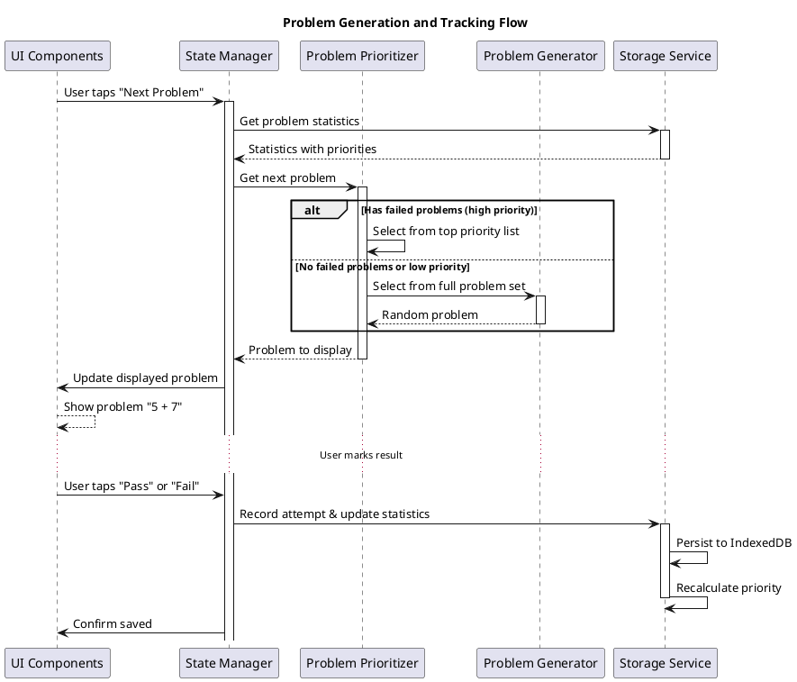
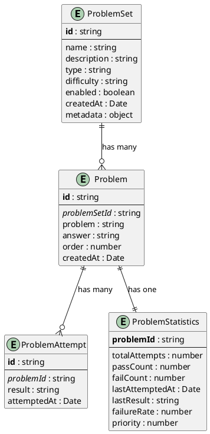

# Software Architecture Design Document

## Easy Practice for Parents

**Version:** 1.8.2  
**Date:** January 9, 2026  
**Status:** In Progress - Epics 1-5 Completed

## Recent Updates

### Bug Fix: Session Not Saved When Closing Early (January 9, 2026)

- **Issue**: When users closed a practice session early (before completing all problems), the session was not saved to the database, causing the history view to remain empty
- **Root Cause**: `endSessionEarly()` function calculated session duration and updated state but did not call `databaseService.saveSession()`
- **Fix Implementation**:
  - Updated `endSessionEarly()` in AppContext to save session to database when there are completed problems
  - Saves session with accurate statistics: `totalProblems` set to `sessionCompletedCount` (not full queue length)
  - Calculates accuracy based on completed problems: `Math.round((sessionPassCount / sessionCompletedCount) * 100)`
  - Only saves if `sessionCompletedCount > 0` to avoid empty sessions
  - Added validation: requires `selectedProblemSetKey`, `sessionStartTime`, and at least one completed problem
- **Testing**:
  - Added 2 new tests verifying session save behavior when ending early
  - Test 1: Verifies session is saved with correct statistics when ending early with completed problems
  - Test 2: Verifies session is NOT saved when ending early with zero completed problems
  - All 440 tests passing
- **Impact**:
  - History view now correctly displays sessions that were closed early
  - Session statistics accurately reflect only the problems that were completed before closing
  - Parents can track partial practice sessions without needing to complete all problems

### Bug Fix: History View Empty Issue (January 9, 2026)

- **Issue**: History view always appeared empty despite completed sessions being saved
- **Root Cause**: `loadSessionHistory()` was checking for `selectedProblemSetId` (which was always null) instead of using `selectedProblemSetKey`
- **Fix Implementation**:
  - **Session Storage Migration**: Changed Session type from `problemSetId: string` to `problemSetKey: string`
  - **Database Schema Update**: Updated sessions table index from `problemSetId` to `problemSetKey` in `lib/db.ts`
  - **Service Layer Update**: Modified `saveSession()` to accept and store `problemSetKey`, updated `getSessionHistory()` to filter by `problemSetKey`
  - **State Management Cleanup**: Completely removed `selectedProblemSetId` from AppContext state to eliminate confusion between IDs and keys
  - **History Loading Fix**: Updated `loadSessionHistory()` to use `selectedProblemSetKey` directly without null checks
  - **Landing View Logic**: Restored landing view conditional rendering based on empty `selectedProblemSetKey` check
- **Impact**:
  - History view now correctly loads and displays session history filtered by selected problem set
  - Reduced state complexity by using only `selectedProblemSetKey` for problem set tracking
  - Landing view properly displays when no problem set is selected (empty `selectedProblemSetKey`)
  - All 438 tests passing after comprehensive test updates

### Session History Feature Refactor (January 2, 2026)

- **Feature Replacement**:
  - Replaced "Struggled Problems Summary" with "Session History" feature
  - Tracks completed practice sessions instead of individual problem failures
  - Provides holistic view of learning progress over time
- **Database Layer**:
  - Added `sessions` table to IndexedDB schema (via Dexie)
  - Session entity fields: `id` (auto-increment), `problemSetKey`, `startTime`, `endTime`, `duration`, `passCount`, `failCount`, `totalProblems`, `accuracy` (calculated), `createdAt` (timestamp)
  - Indexed on `problemSetKey` and `createdAt` for efficient querying
- **Service Layer**:
  - Implemented `saveSession(sessionData)`: Persists completed session to database
  - Implemented `getSessionHistory(problemSetKey, limit)`: Retrieves last N sessions for a problem set, ordered by completion time (newest first)
  - 34 tests covering database operations (sessions table schema, CRUD operations, edge cases)
- **Context Layer (AppContext)**:
  - Removed: `showSummary`, `struggledProblems` state and `toggleSummary`, `loadStruggledProblems` actions
  - Added state:
    - `showHistory` (boolean): Controls HistoryView modal visibility
    - `sessionHistoryLimit` (number): Number of sessions to retrieve (default: 10, options: 10/20/30/40/50)
    - `sessionHistory` (Session[]): Array of completed sessions for current problem set
  - Added actions:
    - `loadSessionHistory()`: Fetches session history from database for current problem set
    - `toggleHistory()`: Opens/closes HistoryView modal
    - `setSessionHistoryLimit(limit)`: Updates history limit preference (persisted to localStorage)
  - Integrated `saveSession()` call when session completes
  - 62 tests covering session history state management and lifecycle
- **UI Components**:
  - **HistoryView Component** (new):
    - Modal overlay displaying session history cards
    - Each card shows: accuracy percentage (with color coding), duration (HH:MM:SS format), total problems, pass/fail counts, completion timestamp (localized)
    - Helper functions: `formatDuration(milliseconds)` → "Xh Ym Zs", `formatDate(timestamp)` → locale string
    - Empty state: "No completed sessions yet" when history is empty
    - Bilingual support via `useLanguage` hook
    - 21 tests covering rendering, formatting, interactions, edge cases
  - **SettingsPanel Component** (updated):
    - Added session history limit dropdown (10/20/30/40/50 options)
    - Conditional rendering: dropdown only shown when `sessionHistoryLimit` prop provided
    - 23 tests total (6 new tests for history limit feature)
  - **PreSessionView & SessionCompleteView** (updated):
    - Changed button text from "View Summary" to "View History"
    - Button calls `onViewSummary` prop (which triggers `loadSessionHistory` + `toggleHistory`)
  - **Removed Components**:
    - Deleted `SummaryView.tsx` and `SummaryView.test.tsx`
    - Removed all struggled problems tracking UI code
- **Localization**:
  - Replaced `summary.*` translation keys with `history.*` keys:
    - `history.title`: "Session History" / "会话历史记录"
    - `history.noSessions`: "No completed sessions yet" / "还没有完成的练习记录"
    - `history.session`: "Session" / "练习"
    - `history.duration`: "Duration" / "时长"
    - `history.accuracy`: "Accuracy" / "准确率"
    - `history.problems`: "Problems" / "题目"
    - `history.passed`: "Passed" / "通过"
    - `history.failed`: "Failed" / "失败"
    - `history.completedAt`: "Completed" / "完成时间"
  - Added `preSession.viewHistory`: "View History" / "查看历史记录"
  - Added `settings.sessionHistoryLimit`: "Session History Limit" / "会话历史记录限制"
- **Page Integration**:
  - Updated `app/page.tsx` to integrate HistoryView component
  - Implemented `handleViewSummary()`: calls `actions.loadSessionHistory()` + `actions.toggleHistory()`
  - Added HistoryView render: conditional on `state.showHistory`
  - Passed `sessionHistoryLimit` and `onSessionHistoryLimitChange` props to SettingsPanel
- **Test Coverage**:
  - All 435 tests passing after refactor
  - 21 new tests for HistoryView component
  - 6 new tests for SettingsPanel history limit feature
  - Updated test assertions in PreSessionView and SessionCompleteView to match new button text
- **Impact**:
  - Enhanced parental insights: session-level progress tracking with trends over time
  - Improved UX: configurable history limits, clear visual presentation with session cards
  - Better data persistence: sessions stored in IndexedDB, survive app restarts
  - Cleaner codebase: simpler session storage vs. complex problem failure tracking
  - Maintained backward compatibility: reset data still works (resets session history)

### Audio Auto-play and UI Improvements (December 25, 2025)

- **Audio Auto-play Bug Fix**:
  - Fixed bug where first audio in a session wouldn't auto-play
  - Root cause: `prevProblemIdRef` was initialized with the current problem's ID, preventing auto-play detection
  - Solution: Initialize `prevProblemIdRef` with `undefined` to ensure first problem triggers auto-play
  - Added comprehensive tests for auto-play scenarios (first load, problem transitions, session start)
- **Audio Button Repositioning**:
  - Moved problem audio button from inline (next to problem text) to top-right corner
  - Positioned at same location as view answer button for consistent UI
  - View answer button shifts to `right-16` when audio button is present (at `right-4`)
  - Problem text remains centered without inline elements
  - Improved mobile UX with fixed button positions
  - Added tests to validate button positioning and layout

### Audio Support for Problems (December 25, 2025)

- **Audio Field Storage**:
  - Added optional `problemAudio` and `answerAudio` fields to Problem entity
  - Stores audio filenames (e.g., "problem1.wav") imported from JSON files
  - Database service maps `problem_audio` → `problemAudio` and `answer_audio` → `answerAudio` during import
  - Audio fields preserved during problem set upgrades for matching problems
- **Audio Playback Integration**:
  - Audio base URL: `https://images.shangjiaming.top`
  - Complete URLs constructed as: `{baseURL}/{filename}`
  - Problem audio: Auto-plays when problem is displayed, can be manually replayed
  - Answer audio: Manual play only when answer is revealed
  - Audio stops automatically when navigating to next problem
- **ProblemDisplay Component Updates**:
  - Added Volume2 icon buttons from Lucide React for audio playback
  - Problem audio button: Positioned in top-right corner (absolute positioning)
  - Answer audio button: Visible next to answer text when `answerAudio` exists and answer is shown
  - Audio playing state indicated by blue icon color (gray when paused)
  - Graceful error handling for failed audio loads
  - Uses HTML5 `<audio>` elements with refs for playback control
  - Auto-play implemented via useEffect hook on problem change
  - Audio cleanup on component unmount and problem navigation
- **Test Infrastructure**:
  - Added HTMLMediaElement mocks to test setup (`tests/setup.ts`)
  - Mocked `play()`, `pause()`, and `load()` methods using Vitest
  - 12 new tests in ProblemDisplay.test.tsx covering:
    - Audio rendering and URL construction
    - Auto-play functionality (first load, problem changes, session start)
    - Button positioning (top-right corner placement)
    - Audio cleanup on problem transitions
  - 3 new tests in database.service.test.ts covering audio field import scenarios
  - All 373 tests passing with audio functionality and bug fixes
- **Type System Updates**:
  - Added `problemAudio?: string` and `answerAudio?: string` to Problem interface
  - Added `problem_audio?: string` and `answer_audio?: string` to ProblemSetJSON import types
  - TypeScript validation ensures audio fields are properly typed throughout codebase
- **Impact**:
  - Enables language learning problem sets with pronunciation support
  - First implementation: Common English Dialogues (Grade 1) with 10+ audio-enabled problems
  - Supports mixed problem sets (some with audio, some without)
  - Audio files hosted on CDN for fast global delivery
  - Graceful degradation: Audio buttons only shown when audio files exist
  - No breaking changes to existing math problem sets (audio fields optional)
  - Improved UX with reliable auto-play and consistent button positioning

### Internationalization (i18n) Support (December 25, 2025)

- **Language Support**:
  - Default language: Chinese (zh)
  - Supported languages: Chinese (zh) and English (en)
  - Language selection persisted in browser localStorage
  - Immediate UI updates on language switch
- **New Language Components**:
  - **LanguageContext** (`contexts/LanguageContext.tsx`):
    - Context provider managing language state with localStorage persistence
    - Exposes: `language` (current language), `setLanguage` (switch function), `t` (translation function)
    - Initializes from localStorage on mount (client-side only to avoid hydration mismatch)
    - Provides `getNestedValue()` for dot notation translation keys (e.g., 'common.start')
    - Fallback mechanism: returns key if translation not found
    - 16 tests covering initialization, switching, persistence, and translation
  - **LanguageSelector** (`components/LanguageSelector.tsx`):
    - Toggle button with flag icons (🇨🇳 for Chinese, 🇺🇸 for English)
    - Displays current language label from translations
    - Integrated into SettingsPanel for easy access
    - Hover effects with border and background color transitions
    - Full keyboard accessibility with proper ARIA labels
    - 12 tests covering rendering, switching, styling, and integration
- **Translation Resources**:
  - **Translation Files**:
    - `/locales/zh.json` - Chinese translations
    - `/locales/en.json` - English translations
    - Organized by sections: common, landing, preSession, session, sessionComplete, summary, settings, errors, loading, problemSets
    - Comprehensive coverage of all user-visible text
- **Bilingual Problem Sets**:
  - **Problem Set Manifest** (`public/problem-sets/manifest.json`):
    - Updated `name` and `description` fields to support bilingual format
    - Format: `{ "en": "English text", "zh": "中文文本" }`
    - All 5 problem sets updated with bilingual names and descriptions
  - **Problem Set JSON Files**:
    - Updated all problem set JSON files with bilingual `name` and `description`
    - Files: addition-within-10.json, addition-within-20.json, subtraction-within-10.json, subtraction-within-20.json, add-subtract-within-10-no-zero.json
- **Type System Updates**:
  - **LocalizedString Type** (`types/problem.types.ts`):
    - New type: `type LocalizedString = string | { en: string; zh: string }`
    - Updated `ProblemSetJSON` interface to use `LocalizedString` for name/description
    - Updated `ProblemSetManifestEntry` interface to use `LocalizedString` for name/description
  - **Utility Functions** (`lib/utils.ts`):
    - Added `getLocalizedString(value: LocalizedString, language: Language): string`
    - Extracts language-specific string from LocalizedString type
    - Handles both string and bilingual object formats
- **Database Service Updates**:
  - Added `normalizeLocalizedString()` helper function
  - Converts LocalizedString to plain English string for database storage
  - Updated `addNewProblemSet()` to normalize bilingual name/description
  - Updated `upgradeProblemSet()` to normalize bilingual name/description
  - Maintains backward compatibility with existing string-based problem sets
- **UI Component Updates**:
  - **SettingsPanel**: Added language selector section with heading and LanguageSelector component
  - Uses `t()` function for all text: title, close button aria-label, language heading
  - **App Layout** (`app/layout.tsx`):
    - Wrapped AppProvider with LanguageProvider to provide i18n context globally
    - Language context available to all components in the tree
- **Testing**:
  - LanguageContext: 16 tests covering initialization, switching, persistence, translations
  - LanguageSelector: 12 tests covering rendering, switching, styling, keyboard accessibility
  - SettingsPanel: Updated tests to include LanguageProvider wrapper
  - All core i18n functionality verified through unit tests
- **Impact**:
  - Chinese parents can use the app in their native language (default)
  - English-speaking users can switch to English via settings
  - Language preference persists across browser sessions
  - Problem sets display names/descriptions in selected language
  - All UI text dynamically updates on language change
  - Improved accessibility for international audience

### Single Page Application (SPA) Architecture Refactor (December 29, 2025)

- **Architecture Change**:
  - Converted from multi-page to Single Page Application (SPA) architecture
  - Merged `app/practice/page.tsx` functionality into `app/page.tsx`
  - Eliminated client-side routing in favor of conditional rendering
  - Removed all `useRouter()` and `router.push()` calls
- **View Management**:
  - All views now rendered conditionally within `app/page.tsx` based on application state
  - View selection logic:
    - `selectedProblemSetKey` is empty → **LandingView** (problem set selection)
    - `isSessionActive === true` → **PracticeSessionView** (active session)
    - `sessionCompletedCount > 0` → **SessionCompleteView** (post-session results)
    - Default (problem set selected, no active session) → **PreSessionView** (pre-session controls)
- **New View Components**:
  - **ErrorView** (`components/ErrorView.tsx`):
    - Reusable error display component extracted from duplicated page code
    - Props: `message` (error text), `onRetry` (retry callback)
    - Displays error message with retry button
    - Consistent error styling across all views
    - 5 tests covering rendering, retry action, and accessibility
  - **LoadingView** (`components/LoadingView.tsx`):
    - Reusable loading state component
    - Simple centered "Loading..." text with proper styling
    - Consistent loading presentation across the app
    - 4 tests covering rendering and accessibility
  - **LandingView** (`components/LandingView.tsx`):
    - Problem set selection interface (original landing page content)
    - Props: `problemSets`, `onSelect`, `isLoading`
    - Renders ProblemSetSelector component
    - Centered layout with title and problem set grid
    - 5 tests covering rendering, selection, and disabled states
  - **PreSessionView** (`components/PreSessionView.tsx`):
    - Pre-session controls view shown after problem set selection
    - Contains StartSessionButton and "View Summary" button
    - Settings icon integration for accessing settings panel
    - Vertical layout with proper spacing
    - 6 tests covering rendering, button interactions, and settings
  - **SessionCompleteView** (`components/SessionCompleteView.tsx`):
    - Post-session statistics and action buttons
    - Displays: session duration, pass/fail/total stats grid
    - Actions: "Start New Session" and "View Summary" buttons
    - Responsive grid layout for statistics
    - 8 tests covering all display scenarios and interactions
  - **PracticeSessionView** (`components/PracticeSessionView.tsx`):
    - Active session interface component
    - Integrates: SessionTimer, ProgressIndicator, ProblemDisplay, AnswerButtons
    - Full-screen practice layout
    - 7 tests covering rendering, timer, progress, and answer marking
- **Component Organization**:
  - Extracted 6 dedicated view components for better separation of concerns
  - Each view component has focused responsibility
  - Improved code reusability and testability
  - Clearer component hierarchy and data flow
- **Removed Files**:
  - `app/practice/page.tsx` - merged into `app/page.tsx`
  - `tests/unit/app/practice/` directory - tests migrated to main page tests
- **Navigation Changes**:
  - Back navigation now uses `actions.selectProblemSet('')` to clear selection
  - No page transitions - instant view changes via React state
  - Maintains browser history with single route `/`
- **Testing**:
  - All 322 tests maintained and passing after refactor
  - Updated navigation tests to verify SPA behavior (no `router.push()` calls)
  - Added comprehensive tests for all new view components
  - Test coverage: ErrorView (5), LoadingView (4), LandingView (5), PreSessionView (6), SessionCompleteView (8), PracticeSessionView (7)
- **Impact**:
  - Simplified application architecture with single entry point
  - Improved performance with instant view transitions
  - Better state management with unified component tree
  - Easier maintenance with clearer component boundaries
  - No user-facing functionality changes
  - All existing features preserved (settings, summary, sessions, etc.)

### Global Settings Panel (December 31, 2025)

- **Refactored to Global Settings**:
  - Settings panel is now global (not problem-set-specific)
  - Available in both LandingView and PreSessionView
  - Language selector moved from landing page into settings panel
  - Problem coverage stored in localStorage (persists across sessions)
  - Reset data now resets ALL statistics globally (not per problem set)
- **Settings Panel Components**:
  - **SettingsIcon** (`components/SettingsIcon.tsx`):
    - Gear icon button with hover effects (scale-110, color change to blue-600)
    - ARIA label: "Settings"
    - Positioned absolutely in top-right corner
    - Minimum height of 48px for accessibility compliance
  - **SettingsPanel** (`components/SettingsPanel.tsx`):
    - Centered modal dialog with backdrop overlay
    - Positioning: `left-1/2 top-1/2 -translate-x-1/2 -translate-y-1/2` (centered)
    - Max-width constraint: `sm:max-w-lg` (~512px on desktop)
    - Full-screen on mobile: `w-full h-full` below `sm` breakpoint
    - Rounded corners on desktop: `sm:rounded-2xl`
    - Max height on desktop: `sm:max-h-[90vh]` with scrollable content
    - Backdrop overlay (z-40) with fade-in animation (`opacity-100`)
    - Modal content (z-50) with white background and shadow
    - Fade-in with scale animation: `opacity-100 scale-100`
    - Close button (X icon) in modal header
    - Contains:
      - Language selector (English/中文)
      - Problem Coverage Slider (percentage-only: 30%, 50%, 80%, 100%)
      - Reset Data Button (resets ALL statistics)
    - Smooth transition animations using `transition-all duration-300`
  - **LanguageSelector** (`components/LanguageSelector.tsx`):
    - Moved from landing page into settings panel
    - Toggle button with flag icons (🇨🇳 for Chinese, 🇺🇸 for English)
    - Full keyboard accessibility with proper ARIA labels
  - **ProblemCoverageDropdown** (`components/ProblemCoverageDropdown.tsx`):
    - Dropdown select element for choosing coverage percentage (30%, 50%, 80%, 100%)
    - Replaces slider UI with dropdown for more direct value selection
    - No longer requires `totalProblems` prop
- **State Management**:
  - Local state `isSettingsOpen` in landing/pre-session views controls modal visibility
  - Problem coverage stored in localStorage with key `problem-coverage`
  - AppContext loads initial problem coverage from localStorage on initialization
  - Coverage changes saved to localStorage immediately via `setProblemCoverage()`
  - Coverage no longer resets to 100 after session starts (persists across sessions)
  - Reset data calls `databaseService.resetStatistics()` globally (not per problem set)
- **UI Reorganization**:
  - Language selector removed from landing page header
  - Language selector now inside settings panel
  - Settings icon added to landing page (top-right corner)
  - Problem coverage slider no longer shows problem count
- **Layout Structure**:
  - Landing page and pre-session view use relative positioning container
  - Settings icon positioned absolutely in top-right corner (right-0)
  - Settings icon visible in both landing and pre-session views (not during active sessions)
- **Accessibility**:
  - Settings icon: ARIA label "Settings", minimum height 48px
  - Settings modal: role="dialog", aria-labelledby="settings-title"
  - Close button: ARIA label "Close settings"
  - Full keyboard navigation support
  - Modal pattern provides better focus management
- **Translation Updates**:
  - English: `settings.resetDataDescription` → "Clear all statistics data for all problem sets"
  - English: `settings.resetConfirm` → "Are you sure you want to reset all statistics data? This will clear data for ALL problem sets and cannot be undone."
  - Chinese: `settings.resetDataDescription` → "清除所有练习集的统计数据"
  - Chinese: `settings.resetConfirm` → "确定要重置所有统计数据吗？这将清除所有练习集的数据，且此操作无法撤销。"
- **Testing**:
  - 5 tests for SettingsIcon component (including 48px minimum height)
  - 17 tests for SettingsPanel component (updated for global settings)
  - 11 tests for LandingView component (including settings panel integration)
  - Updated AppContext tests for global reset and localStorage persistence
  - Updated ProblemCoverageDropdown tests (dropdown UI replaces slider)
  - All 364 tests passing
- **Components Modified**:
  - `components/SettingsIcon.tsx` (added min-h-[48px] for accessibility)
  - `components/SettingsPanel.tsx` (added LanguageSelector, removed totalProblems prop)
  - `components/LandingView.tsx` (added SettingsIcon and SettingsPanel)
  - `components/ProblemCoverageDropdown.tsx` (replaced slider with dropdown select)
  - `contexts/AppContext.tsx` (localStorage persistence, global reset)
  - `app/page.tsx` (removed totalProblems state)
  - `locales/en.json` (updated reset confirmation messages)
  - `locales/zh.json` (updated reset confirmation messages)
- **Impact**:
  - Unified settings experience across all views
  - Language accessible from landing page (no need to select problem set first)
  - Problem coverage persists across sessions (respects user preference)
  - Reset data clearly global (affects ALL problem sets)
  - Simplified problem coverage display (percentage works for all problem set sizes)
  - Better accessibility with settings available earlier in user journey

### Back Navigation Icon (December 20, 2025)

- **Practice Page Navigation Enhancement**:
  - Added chevron-left back icon (Lucide React) in top-left corner
  - Replaces previous clickable title functionality
  - Title is now a non-interactive `<h1>` heading (improved semantic structure)
  - Back icon positioned absolutely with `left-0` positioning
- **Visual Design**:
  - Icon size: h-8 w-8 (32px)
  - Hover effects: scale-110 transform and color change to blue-600
  - Smooth transitions with `transition-all` class
  - Gray-600 default color with blue-600 hover state
- **Accessibility**:
  - ARIA label: "Back to landing page"
  - Full keyboard support (button element)
  - Clear visual affordance with hover feedback
- **User Experience**:
  - Clears selected problem set and navigates to landing page
  - Intuitive left-positioned back navigation (standard UI pattern)
  - No confirmation dialog for quick navigation
- **Layout Structure**:
  - Relative container wraps both back button and heading
  - Heading centered with Flexbox
  - Back button positioned absolutely to avoid layout shift
- **Testing**:
  - 4 new focused tests covering back icon rendering, navigation behavior, hover effects, and title changes
  - Updated 3 existing Epic 3 tests to query heading by role instead of button
  - All 308 tests passing
- **Components Modified**:
  - `app/practice/page.tsx` (refactored header structure)
  - `tests/unit/app/practice/page.test.tsx` (new back icon tests)
  - `tests/unit/app/practice/page.epic3.test.tsx` (updated heading queries)

### Session Timer Component (December 20, 2025)

- **New SessionTimer Component**:
  - Displays real-time elapsed time during active practice sessions
  - Format: HH:MM:SS (e.g., "00:02:35")
  - Updates automatically every second using setInterval
  - Position: Above ProgressIndicator in practice page
  - Only visible when `isSessionActive` is true and `sessionStartTime` is not null
- **Implementation Details**:
  - Uses React hooks (useState, useEffect) for state and side effects
  - Proper cleanup with clearInterval on unmount or when session becomes inactive
  - Calculates elapsed time as `Date.now() - sessionStartTime`
  - Format helper function pads hours, minutes, seconds with leading zeros
- **Accessibility**:
  - ARIA label: "Session elapsed time"
  - Semantic HTML: `<time>` element for time display
- **Testing**:
  - 14 comprehensive tests for SessionTimer component covering:
    - Time formatting (HH:MM:SS with leading zeros)
    - Timer updates (every second, across minute/hour boundaries)
    - Session state management (visibility based on session active state)
    - Cleanup (interval cleared on unmount or session end)
    - Accessibility (ARIA labels, semantic elements)
  - 8 integration tests for practice page covering:
    - Timer display during active sessions
    - Timer positioning above progress indicator
    - Timer updates as time passes
    - Timer persistence across problem changes
    - Timer hiding when session completes
- **Components Modified**:
  - `components/SessionTimer.tsx` (new)
  - `app/practice/page.tsx` (integrated SessionTimer)
- All 306 tests passing (including 22 new timer-related tests)

### Answer Toggle Feature for ProblemDisplay (December 20, 2025)

- **Enhanced ProblemDisplay Component**:
  - Added Eye/EyeOff toggle icon (Lucide React) in top-right corner
  - Clicking toggle shows/hides the answer below the problem
  - Answer displays with different styling (text-2xl, green color) vs problem (text-6xl, gray-900)
  - Toggle defaults to OFF (answer hidden) when new problem loads
  - Automatic state reset via useEffect when problem changes
- **Accessibility Features**:
  - Dynamic ARIA labels ("Show answer" / "Hide answer")
  - Full keyboard support (Enter and Space keys)
  - Mobile-optimized touch targets (44px × 44px minimum)
  - Hover state with visual feedback (bg-gray-100)
- **Use Case**: Allows parents to quickly verify answers without memorizing them, particularly useful when reviewing struggled problems
- **Testing**: Added 13 new tests covering toggle rendering, state management, answer visibility, keyboard accessibility, and mobile touch targets
- All 284 tests passing

### Versioned Problem Set Management (December 20, 2025)

- **Added New Problem Sets**:
  - `addition-within-10.json` (66 problems: sums 0-10)
  - `subtraction-within-10.json` (66 problems: minuends 0-10)
- **Manifest-Based Problem Set Discovery**:
  - Created `/public/problem-sets/manifest.json` listing all problem sets with versions and paths
  - App auto-discovers problem sets from manifest instead of hardcoded paths
  - Removed hardcoded `PROBLEM_SET_PATHS` constant
- **Versioned Import Logic**:
  - Added `version` field to `ProblemSet` type
  - Implemented `compareVersions()` utility for semantic version comparison
  - Problem sets only import/upgrade if version is higher than existing
  - Version checking prevents duplicate imports and accidental downgrades
- **Smart Problem Set Upgrades**:
  - When upgrading (higher version detected), old problems are replaced with new ones
  - Statistics preserved for matching problems (same problem text and answer)
  - New problems get fresh statistics
  - Removed problems lose their statistics
- **Enhanced Problem Service**:
  - Added `loadManifest()` method to fetch problem set manifest
  - Updated `loadDefaultProblemSets()` to iterate through manifest entries
  - Added cleanup: `loadDefaultProblemSets()` now removes problem sets in the local database that are no longer listed in the manifest
  - Graceful error handling: continues loading other sets if one fails
- **Type Definitions**:
  - Added `ProblemSetManifest` and `ProblemSetManifestEntry` types
  - Updated `ProblemSet` interface with optional `version` field
- **Complete Test Coverage**: Added 23 new tests covering version comparison, manifest loading, and versioned import scenarios
- All functionality tested and validated with 256 passing tests

### Epic 3 Implementation - Mobile-First Design (December 20, 2025)

- **Enhanced Button Styling for Mobile**: All buttons now use consistent h-12 height (48px minimum) for easy tapping on mobile devices
- **Improved Button Accessibility**: Updated all buttons with proper padding (px-6 or px-8), font sizing, and transition-colors for smooth visual feedback
- **Responsive Layout Optimization**: Confirmed and tested mobile-first layout with proper viewport handling, flexible spacing, and dynamic orientation support
- **High Contrast Color Scheme**: Implemented consistent color palette with sufficient contrast for low-light conditions (gray-900 text, white backgrounds, colorful buttons)
- **Engaging Visual Design**: Added colorful button states (blue for selection, green for success actions, red for destructive actions), subtle transition effects, rounded corners, and shadow effects
- **Visual Feedback**: All interactive elements include hover states and transition-colors for smooth, non-distracting animations
- **Mobile Touch Targets**: Ensured all buttons meet or exceed 48px height requirement with appropriate horizontal padding (gap-4 spacing)
- **Consistent Typography**: Maintained clear visual hierarchy with large text (3xl headings, 6xl problem display) for easy readability
- **Added 28 comprehensive tests** covering responsive design, button sizing, contrast, hover states, and visual engagement
- All Epic 3 acceptance criteria met and tested

### Epic 4 Implementation - Session-Based Practice with Progress Tracking (December 20, 2025)

- **Implemented Session State Management**: Added `isSessionActive`, `sessionQueue`, and `sessionCompletedCount` to AppContext
- **Implemented Session Statistics Tracking**: Added `sessionStartTime`, `sessionDuration`, `sessionPassCount`, and `sessionFailCount` to AppContext
  - Timer starts when "Start New Session" is clicked
  - Duration calculated when session completes (in milliseconds)
  - Pass/Fail counts track current session only (reset on new session)
  - Statistics displayed on completion screen with visual formatting
- **Implemented Session Queue Generation**: Algorithm that selects problems based on success ratios (<90% always included, ≥90% included with 30% probability)
- **Implemented StartSessionButton Component**: Explicit button to start practice sessions
- **Implemented ProgressIndicator Component**: Displays "X / Y" progress near problem display
- **Enhanced Session Completion Screen**: Displays comprehensive statistics including:
  - Session duration in HH:MM:SS format using `formatDuration()` utility
  - Pass count (green badge)
  - Fail count (red badge)
  - Total problems completed (blue badge)
- **Updated Main Page Flow**: Changed from continuous problem flow to session-based approach
  - User must explicitly start a session
  - Progress indicator shows session progress
  - Session complete screen with detailed statistics and option to start new session
  - Switching problem types resets the session and all statistics
- **Removed Auto-Load Behavior**: App no longer auto-loads first problem on initialization
- **Added 48 new tests** for session management, queue generation, progress tracking, timer tracking, statistics tracking, and type switching
- All Epic 4 acceptance criteria met and tested

### Epic 5 Implementation - Problem Set Selection and Navigation (December 20, 2025) 🚧 IN PROGRESS

- **Problem Set Selection Landing Page**: New landing page at "/" for selecting problem sets
- **Routing Structure**:
  - `/` - Landing page with ProblemSetSelector component
  - `/practice` - Practice page (moved from previous main page)
- **ProblemSetSelector Component**: Displays all available problem sets with selection capability
- **ChangeProblemSetButton Component**: Allows navigation back to landing page
- **Auto-Start Session**: Session starts automatically upon problem set selection
- **Session Management Updates**:
  - Added `selectedProblemSetId` to AppContext state
  - Session queue filtered by selected problem set
  - "Start New Session" restarts with same problem set
  - "Change Problem Set" returns to landing page and clears session
- **Removed TypeSelector Component**: Replaced by problem set selection on landing page
- All Epic 5 acceptance criteria will be tested and validated

### Design Refinement - Streamlined User Flow (December 20, 2025)

- **Removed NextProblemButton from main page**: Pass/Fail buttons now automatically load the next problem
- **Simplified workflow**: Mark answer → Next problem loads automatically → Repeat
- **Improved UX**: Reduced cognitive load by eliminating redundant button
- NextProblemButton component retained in codebase for potential future use

### Epic 2 Implementation - Simple Performance Tracking (December 20, 2025)

- Implemented **AnswerButtons Component**: Allows parents to mark problems as Pass or Fail
- Implemented **SummaryView Component**: Displays list of struggled problems with details
- Implemented **ResetDataButton Component**: Allows clearing performance data for the currently selected problem type with confirmation
- Integrated all new components into main page with proper state management
- Added comprehensive test coverage for all new components (29 additional tests)
- All Epic 2 acceptance criteria met and tested

### Enhancement - Type-Specific Data Reset (December 20, 2025)

- Enhanced **Reset Data functionality** to only reset the currently selected problem type
- Added `resetStatisticsByProblemSetKey()` method to DatabaseService for targeted reset operations
- Updated ResetDataButton to display type-specific confirmation messages (e.g., "reset addition problems")
- Modified AppContext to use selectedProblemSetKey when resetting data
- This allows parents to reset one problem type without affecting progress in other types
- Added comprehensive test coverage for the new reset behavior

### Bug Fix - Date Storage (December 20, 2025)

- Fixed "Invalid key provided" error in Next Problem button by converting Date objects to Unix timestamps (milliseconds)
- Updated all date fields (`createdAt`, `attemptedAt`, `lastAttemptedAt`) to store numbers instead of Date objects
- This ensures proper IndexedDB indexing support across all browsers
- Modified `formatDate()` utility to accept timestamps and convert them for display

### Bug Fix - State Variable Initialization (December 20, 2025)

- Fixed "Invalid key provided" error when `selectedProblemSetKey` was undefined in database queries
- Changed state capture pattern in `loadNextProblem()`, `submitAnswer()`, and `initializeApp()` to use initialized objects
- Ensures variables always have valid values before being passed to database queries
- Replaced `let` declarations with object initialization pattern for safer state access

## Implementation Status

### Completed Features

#### Epic 1: Parent-Focused Problem Generator ✅

- ✅ **TypeSelector Component**: Allows parents to switch between addition and subtraction problems
- ✅ **ProblemDisplay Component**: Displays math problems with large, readable text (6xl size)
  - **Answer Toggle Feature** (December 20, 2025): Eye/EyeOff icon button in top-right corner to show/hide answer
  - Toggle defaults to OFF (answer hidden) when problem loads
  - Answer displays below problem with smaller text (2xl) and green color for differentiation
  - Automatic toggle state reset when problem changes
  - Full keyboard accessibility (Enter/Space key support)
  - Proper ARIA labels and mobile-optimized touch targets (44px minimum)
- ✅ **Main Page (app/page.tsx)**: Integrates all components with AppContext for state management
- ✅ **Priority Algorithm**: Implements problem prioritization based on failure rates (lib/utils.ts)
- ✅ **Problem Selection**: Avoids repetition by tracking recently shown problems
- ✅ **Responsive Design**: Mobile-first layout with proper touch targets (48px minimum height)

#### Epic 2: Simple Performance Tracking ✅

- ✅ **AnswerButtons Component**: Pass/Fail buttons that automatically load next problem after marking
- ✅ **SummaryView Component**: Modal displaying struggled problems with failure rates and details
- ✅ **ResetDataButton Component**: Confirmation-based data reset functionality (type-specific)
- ✅ **Performance Tracking**: Automatic storage of pass/fail results in IndexedDB
- ✅ **Problem Details**: Expandable view showing total attempts, pass count, and last attempted date
- ✅ **Empty State Handling**: Appropriate messages when no struggled problems exist
- ✅ **Streamlined Workflow**: Pass/Fail action automatically triggers next problem load
- ✅ **Type-Specific Reset**: Reset data only affects the currently selected problem type

#### Epic 3: Mobile-First Design ✅

- ✅ **Mobile-First Layout**: Responsive flex-based layout with min-h-screen, proper padding, and max-width constraints
- ✅ **Touch-Friendly Buttons**: All buttons use h-12 (48px) height with proper padding (px-6/px-8) for mobile interaction
- ✅ **Large Typography**: Clear visual hierarchy with 3xl headings and 6xl problem display for readability
- ✅ **High Contrast Design**: Gray-900 text on white backgrounds with colorful, accessible button states
- ✅ **Engaging Visuals**: Colorful button palette (blue for primary, green for success, red for destructive), rounded corners, shadows, and smooth transitions
- ✅ **Responsive Adaptation**: Flexible layout that adjusts seamlessly between portrait and landscape orientations
- ✅ **Visual Feedback**: All interactive elements include hover states and transition-colors animations
- ✅ **Consistent Spacing**: Proper gap spacing (gap-4, space-y-8) prevents accidental taps and visual clutter
- ✅ **Session Complete Celebration**: Emoji-enhanced completion screen (🎉) for child engagement

#### Epic 4: Session-Based Practice with Progress Tracking ✅

- ✅ **Session State Management**: Ephemeral session state in AppContext (not persisted to DB)
- ✅ **Adaptive Queue Generation**: Problems selected based on success ratios with intelligent filtering
  - Success ratio < 90%: Always included
  - Success ratio ≥ 90%: 30% probability of inclusion
  - No historical data: All problems included
- ✅ **StartSessionButton Component**: Explicit control over when practice begins
- ✅ **ProgressIndicator Component**: Real-time "X / Y" display showing session progress
- ✅ **Session Completion UI**: Celebration screen with completion count and option to start new session
- ✅ **Type Switch Behavior**: Sessions reset when switching between addition/subtraction
- ✅ **Session-Based Problem Flow**: Problems advance through queue as answers are submitted

#### Epic 5: Audio Support for Problems ✅

- ✅ **Audio Field Storage**: Optional `problemAudio` and `answerAudio` fields added to Problem entity
- ✅ **JSON Import Support**: Audio filenames imported from `problem_audio` and `answer_audio` fields in problem set JSON files
- ✅ **Audio URL Construction**: Complete URLs built as `https://images.shangjiaming.top/{filename}` for CDN delivery
- ✅ **Problem Audio Auto-Play**: Audio automatically plays when new problem is displayed, with manual replay option
- ✅ **Answer Audio Manual Play**: Audio playback button shown next to answer (only plays on user click)
- ✅ **Audio State Management**: Playing state indicated by blue icon color, with automatic cleanup on navigation
- ✅ **ProblemDisplay Integration**: Volume2 icon buttons from Lucide React for audio playback controls
- ✅ **Graceful Degradation**: Audio buttons only shown when audio files exist, error handling for failed loads
- ✅ **Test Coverage**: 11 new tests covering audio rendering, URL construction, and playback scenarios

### Test Coverage

- 366 tests passing across 28 test files
- Component tests: TypeSelector, ProblemDisplay (31 tests including toggle, accessibility, and audio), AnswerButtons, SummaryView, ResetDataButton, ProgressIndicator, StartSessionButton, ProblemSetSelector, NextProblemButton
- Integration tests: Landing page, Practice page with Epic 2, Epic 3, Epic 4, and Epic 5 components
- Unit tests: Priority calculation, database services (including audio field import), utilities, session queue generation, version comparison
- Context tests: Session state, start session action, progress tracking, type switch reset, problem set selection
- Epic 3 tests: Responsive design, button sizing, contrast, hover states, and visual engagement (28 tests)
- Epic 5 tests: Audio field import (3 tests in database.service.test.ts), audio rendering and URL construction (8 tests in ProblemDisplay.test.tsx)
- ProblemDisplay toggle tests: Icon rendering, answer visibility, state management, keyboard accessibility (13 tests)
- HTMLMediaElement mocks: play(), pause(), load() methods mocked in test setup for audio testing
- Note: NextProblemButton component tests retained but component not used in main page flow

---

## Table of Contents

1. [System Architecture](#1-system-architecture)
2. [Technology Stack](#2-technology-stack)
3. [Data Model](#3-data-model)
4. [Interface Specifications](#4-interface-specifications)
5. [Deployment Architecture](#5-deployment-architecture)
6. [Repository Structure](#6-repository-structure)

---

## 1. System Architecture

### 1.1 Overview

The Easy Practice app is a **mobile-first web application** designed as a **Single Page Application (SPA)** with a **local-first architecture**. The application runs entirely in the browser with no backend server, storing all data locally using IndexedDB.

### 1.2 Module Division

The system follows a **layered architecture** with clear separation of concerns:

**Frontend Layer (Client-Side)**

- **UI Components Module**: Reusable React components for problem display, buttons, and summary views
- **State Management Module**: Centralized state using React Context API for current problem, performance data, and UI state
- **Problem Generator Module**: Logic for generating all possible addition/subtraction problems within constraints
- **Problem Prioritization Module**: Algorithm to prioritize previously failed problems based on statistics
- **Local Storage Module**: Interface for persisting and retrieving performance data using IndexedDB

### 1.3 C4 Diagrams

#### Context Diagram (Level 1)

```plantuml
@startuml
!include https://raw.githubusercontent.com/plantuml-stdlib/C4-PlantUML/master/C4_Context.puml

Person(parent, "Parent", "Primary user who facilitates practice")
Person(child, "Child (3-9 years)", "Indirect user, answers problems verbally")

System(mathApp, "Easy Practice", "Mobile-first web app for generating and tracking problems")

System_Ext(browser, "Web Browser", "Chrome, Safari, Firefox on mobile/desktop")

Rel(parent, mathApp, "Uses", "Generates problems, marks pass/fail, views summary")
Rel(child, parent, "Answers verbally")
Rel(mathApp, browser, "Runs in")

@enduml
```

#### Container Diagram (Level 2)

```plantuml
@startuml
!include https://raw.githubusercontent.com/plantuml-stdlib/C4-PlantUML/master/C4_Container.puml

Person(parent, "Parent", "Uses app to generate problems")

System_Boundary(mathApp, "Easy Practice") {
    Container(spa, "Single Page Application", "JavaScript/TypeScript, React/Next.js", "Provides UI for problem generation and tracking")
    ContainerDb(localStorage, "Local Storage", "Browser localStorage/IndexedDB", "Stores performance data locally")
}

Rel(parent, spa, "Interacts with", "HTTPS")
Rel(spa, localStorage, "Reads/writes", "Browser API")

@enduml
```

#### Component Diagram (Level 3)

```plantuml
@startuml
!include https://raw.githubusercontent.com/plantuml-stdlib/C4-PlantUML/master/C4_Component.puml

Container_Boundary(spa, "Single Page Application") {
    Component(uiComponents, "UI Components", "React/Next.js Components", "Displays problems, buttons, summary")
    Component(stateManager, "State Manager", "React Context API", "Manages application state")
    Component(problemGenerator, "Problem Generator", "TypeScript Module", "Generates all math problems")
    Component(prioritizer, "Problem Prioritizer", "TypeScript Module", "Prioritizes failed problems")
    Component(storageService, "Storage Service", "TypeScript Module", "Manages IndexedDB operations")
}

Rel(uiComponents, stateManager, "Reads/updates state")
Rel(stateManager, problemGenerator, "Requests problem set")
Rel(stateManager, prioritizer, "Gets next problem to display")
Rel(stateManager, storageService, "Persists/retrieves data")
Rel(prioritizer, problemGenerator, "Uses for problem pool")

@enduml
```

### 1.4 Component Interaction Flowchart



### 1.5 Key Architectural Patterns

- **Single Page Application (SPA)**: Provides fast, responsive user experience without page reloads
- **Component-Based Architecture**: Promotes reusability and maintainability with React
- **Local-First**: All data stored locally in browser for offline capability and fast access
- **Separation of Concerns**: Clear boundaries between UI, business logic, and data persistence
- **Static Site Generation (SSG)**: Next.js static export for optimal performance and simple deployment

### 1.6 Performance Considerations

- **Pre-generated Problem Set**: All 462 problems generated once and stored in IndexedDB
- **Priority-based Selection**: Fast retrieval using indexed queries on priority scores
- **Lazy Loading**: Components loaded on-demand to reduce initial bundle size
- **Memoization**: Cache calculations to avoid redundant processing
- **Service Worker**: Enable offline functionality via PWA capabilities

---

## 2. Technology Stack

### 2.1 Core Technologies

| Category               | Technology           | Version  | Justification                                 |
| ---------------------- | -------------------- | -------- | --------------------------------------------- |
| **Frontend Framework** | Next.js              | 14+      | SSG support, App Router, optimal performance  |
| **UI Library**         | React                | 18+      | Component reusability, strong ecosystem       |
| **Language**           | TypeScript           | 5+       | Type safety for math logic, better DX         |
| **State Management**   | React Context API    | Built-in | Sufficient for app complexity, no extra deps  |
| **UI Styling**         | Tailwind CSS         | 3+       | Mobile-first utilities, rapid development     |
| **Icons**              | lucide-react         | Latest   | Clean icons, tree-shakeable, React components |
| **Data Storage**       | IndexedDB (Dexie.js) | 4+       | Structured storage, 50MB+ capacity, indexing  |
| **Build Tool**         | Next.js Built-in     | 14+      | Optimized builds, code splitting              |
| **Testing**            | Vitest + RTL         | Latest   | Fast testing, user-focused                    |
| **Code Quality**       | ESLint + Prettier    | Latest   | Enforce standards, consistency                |
| **Hosting**            | AWS S3 + CloudFront  | N/A      | Static hosting, global CDN, cost-effective    |
| **PWA Support**        | next-pwa             | Latest   | Offline support, installable app              |

### 2.2 Development Dependencies

```json
{
  "dependencies": {
    "next": "^14.2.0",
    "react": "^18.3.0",
    "react-dom": "^18.3.0",
    "dexie": "^4.0.0",
    "dexie-react-hooks": "^1.1.7",
    "lucide-react": "^0.428.0",
    "clsx": "^2.1.0",
    "tailwind-merge": "^2.5.0"
  },
  "devDependencies": {
    "@types/node": "^20.14.0",
    "@types/react": "^18.3.0",
    "@types/react-dom": "^18.3.0",
    "@typescript-eslint/eslint-plugin": "^7.16.0",
    "@typescript-eslint/parser": "^7.16.0",
    "eslint": "^8.57.0",
    "eslint-config-next": "^14.2.0",
    "eslint-config-prettier": "^9.1.0",
    "typescript": "^5.5.0",
    "tailwindcss": "^3.4.0",
    "autoprefixer": "^10.4.0",
    "postcss": "^8.4.0",
    "vitest": "^2.0.0",
    "@vitest/ui": "^2.0.0",
    "@testing-library/react": "^16.0.0",
    "@testing-library/jest-dom": "^6.4.0",
    "@testing-library/user-event": "^14.5.0",
    "prettier": "^3.3.0",
    "prettier-plugin-tailwindcss": "^0.6.0",
    "husky": "^9.1.0",
    "lint-staged": "^15.2.0"
  }
}
```

### 2.3 Technology Choices Rationale

#### Next.js over Vite

- **SSG Support**: Static export for S3 + CloudFront deployment
- **App Router**: Modern routing with layouts and server components
- **Built-in Optimizations**: Image optimization, font optimization, code splitting
- **Production Ready**: Battle-tested framework with excellent documentation

#### React Context API over Redux

- **Simplicity**: No boilerplate for simple state management
- **Built-in**: No additional dependencies
- **Sufficient**: App state is straightforward (current problem, statistics, UI state)
- **Performance**: With proper memoization, no performance concerns

#### IndexedDB (Dexie.js) over localStorage

- **Capacity**: 50MB+ vs 5-10MB for localStorage
- **Structured Data**: Supports complex queries and indexing
- **Performance**: Asynchronous, doesn't block UI thread
- **Versioning**: Built-in schema migration support

#### AWS S3 + CloudFront over Other Platforms

- **Cost-effective**: ~$1.50/month for typical usage
- **Global CDN**: 450+ edge locations worldwide
- **Scalability**: Automatic scaling with no infrastructure management
- **Reliability**: 99.99% availability SLA

---

## 3. Data Model

### 3.1 Overview

The application uses **IndexedDB** for local data persistence with three core entities: Problems, Attempts, and Statistics. All problems are pre-generated on first app launch and stored locally.

### 3.2 Entity Definitions

#### Entity 1: Problem

Represents a single problem with its question and answer.

| Field          | Type   | Description                      | Constraints                                     |
| -------------- | ------ | -------------------------------- | ----------------------------------------------- |
| `id`           | string | Unique identifier (UUID)         | Primary Key, auto-generated                     |
| `problem`      | string | Problem text (e.g., "5 + 7")     | Required, max 200 chars                         |
| `answer`       | string | Correct answer (e.g., "12")      | Required, max 50 chars                          |
| `problemAudio` | string | Audio filename for problem       | Optional, e.g., "problem1.wav"                  |
| `answerAudio`  | string | Audio filename for answer        | Optional, e.g., "answer1.wav"                   |
| `category`     | string | Problem type                     | 'addition-within-20' or 'subtraction-within-20' |
| `createdAt`    | number | When problem was created         | Unix timestamp (milliseconds)                   |

**Sample Data:**

```json
{
  "id": "550e8400-e29b-41d4-a716-446655440000",
  "problem": "What is your name?",
  "answer": "My name is Sean.",
  "problemAudio": "f6429fe0f1a76611670df7e1234af936.wav",
  "answerAudio": "f7a9b80833e93c7e86edc91d77de0ed0.wav",
  "problemSetKey": "common-english-dialogues-grade1",
  "createdAt": 1703069400000
}
```

#### Entity 3: ProblemAttempt

Tracks each attempt at solving a problem.

| Field         | Type   | Description              | Constraints                   |
| ------------- | ------ | ------------------------ | ----------------------------- |
| `id`          | string | Unique identifier (UUID) | Primary Key, auto-generated   |
| `problemId`   | string | Reference to Problem     | Foreign Key                   |
| `result`      | string | Outcome of attempt       | 'pass' or 'fail'              |
| `attemptedAt` | number | When attempt was made    | Unix timestamp (milliseconds) |

**Sample Data:**

```json
{
  "id": "660e8400-e29b-41d4-a716-446655440001",
  "problemId": "p-550e8400-e29b-41d4-a716-446655440000",
  "result": "fail",
  "attemptedAt": 1703069460000
}
```

#### Entity 4: ProblemStatistics

Aggregated statistics for each problem to enable fast prioritization.

| Field             | Type           | Description                   | Constraints                             |
| ----------------- | -------------- | ----------------------------- | --------------------------------------- |
| `problemId`       | string         | Reference to Problem          | Primary Key, Foreign Key                |
| `totalAttempts`   | number         | Total number of attempts      | ≥ 0                                     |
| `passCount`       | number         | Number of successful attempts | ≥ 0                                     |
| `failCount`       | number         | Number of failed attempts     | ≥ 0                                     |
| `lastAttemptedAt` | number \| null | Most recent attempt timestamp | Unix timestamp (milliseconds), nullable |
| `lastResult`      | string         | Most recent attempt result    | 'pass', 'fail', or null                 |
| `failureRate`     | number         | Percentage of failed attempts | 0.0 to 1.0 (computed)                   |
| `priority`        | number         | Calculated priority score     | Higher = show sooner                    |

**Sample Data:**

```json
{
  "problemId": "p-550e8400-e29b-41d4-a716-446655440000",
  "totalAttempts": 3,
  "passCount": 1,
  "failCount": 2,
  "lastAttemptedAt": 1703069700000,
  "lastResult": "fail",
  "failureRate": 0.67,
  "priority": 67
}
```

### 3.3 JSON Import Format

#### Problem Set JSON Structure

Problems are imported from JSON files with the following format:

```json
{
  "version": "1.0",
  "problemSet": {
    "name": "Addition within 20",
    "description": "Basic addition problems with sums up to 20",
    "type": "addition",
    "difficulty": "easy",
    "metadata": {
      "maxOperand": 20,
      "minOperand": 0,
      "targetAge": "3-9",
      "estimatedTime": "5-10 minutes"
    }
  },
  "problems": [
    {
      "problem": "1 + 1",
      "answer": "2"
    },
    {
      "problem": "What is your name?",
      "answer": "My name is Sean.",
      "problem_audio": "f6429fe0f1a76611670df7e1234af936.wav",
      "answer_audio": "f7a9b80833e93c7e86edc91d77de0ed0.wav"
    },
    {
      "problem": "5 + 7",
      "answer": "12"
    }
  ]
}
```

#### Multiple Problem Sets

Multiple problem sets can be stored in a single JSON file:

```json
{
  "version": "1.0",
  "problemSets": [
    {
      "name": "Addition within 20",
      "description": "Basic addition problems",
      "type": "addition",
      "difficulty": "easy",
      "problems": [
        { "problem": "1 + 1", "answer": "2" },
        { "problem": "2 + 3", "answer": "5" }
      ]
    },
    {
      "name": "Subtraction within 20",
      "description": "Basic subtraction problems",
      "type": "subtraction",
      "difficulty": "easy",
      "problems": [
        { "problem": "5 - 2", "answer": "3" },
        { "problem": "10 - 4", "answer": "6" }
      ]
    }
  ]
}
```

#### Sample Problem Set Files

**File: `public/problem-sets/addition-within-20.json`**

```json
{
  "version": "1.0",
  "problemSet": {
    "name": "Addition within 20",
    "description": "Practice addition with sums up to 20",
    "type": "addition",
    "difficulty": "easy",
    "metadata": {
      "maxSum": 20,
      "totalProblems": 231
    }
  },
  "problems": [
    { "problem": "0 + 0", "answer": "0" },
    { "problem": "0 + 1", "answer": "1" },
    { "problem": "1 + 0", "answer": "1" },
    { "problem": "1 + 1", "answer": "2" }
  ]
}
```

### 3.4 Entity Relationship Diagram



### 3.5 IndexedDB Schema (Dexie.js)

```typescript
// lib/db.ts
import Dexie, { Table } from 'dexie';

export interface ProblemSet {
  id?: string;
  name: string;
  description?: string;
  problemSetKey: string;
  difficulty?: string;
  enabled: boolean;
  createdAt: Date;
  metadata?: Record<string, any>;
}

export interface Problem {
  id?: string;
  problemSetId: string;
  problem: string;
  answer: string;
  createdAt: Date;
}

export interface ProblemAttempt {
  id?: string;
  problemId: string;
  result: 'pass' | 'fail';
  attemptedAt: Date;
}

export interface ProblemStatistics {
  problemId: string;
  totalAttempts: number;
  passCount: number;
  failCount: number;
  lastAttemptedAt: Date | null;
  lastResult: 'pass' | 'fail' | null;
  failureRate: number;
  priority: number;
}

export class MathPracticeDB extends Dexie {
  problemSets!: Table<ProblemSet, string>;
  problems!: Table<Problem, string>;
  attempts!: Table<ProblemAttempt, string>;
  statistics!: Table<ProblemStatistics, string>;

  constructor() {
    super('MathPracticeDB');

    this.version(1).stores({
      problemSets: 'id, type, enabled, createdAt',
      problems: 'id, problemSetId, createdAt',
      attempts: 'id, problemId, attemptedAt, result',
      statistics: 'problemId, priority, failureRate, lastAttemptedAt',
    });
  }
}

export const db = new MathPracticeDB();
```

### 3.6 Data Access Patterns

#### Pattern 1: Import Problems from JSON

On app first launch, load problems from JSON files:

```typescript
interface ProblemSetJSON {
  version: string;
  problemSet?: {
    name: string;
    description?: string;
    problemSetKey: string;
    difficulty?: string;
    metadata?: Record<string, any>;
  };
  problemSets?: Array<{
    name: string;
    description?: string;
    problemSetKey: string;
    difficulty?: string;
    metadata?: Record<string, any>;
    problems: Array<{
      problem: string;
      answer: string;
    }>;
  }>;
  problems?: Array<{
    problem: string;
    answer: string;
  }>;
}

async function importProblemsFromJSON(jsonData: ProblemSetJSON): Promise<void> {
  await db.transaction(
    'rw',
    db.problemSets,
    db.problems,
    db.statistics,
    async () => {
      // Handle single problem set
      if (jsonData.problemSet && jsonData.problems) {
        const problemSetId = crypto.randomUUID();

        // Insert problem set
        await db.problemSets.add({
          id: problemSetId,
          name: jsonData.problemSet.name,
          description: jsonData.problemSet.description,
          type: jsonData.problemSet.type,
          difficulty: jsonData.problemSet.difficulty,
          enabled: true,
          createdAt: new Date(),
          metadata: jsonData.problemSet.metadata,
        });

        // Insert problems
        for (const p of jsonData.problems) {
          const problemId = crypto.randomUUID();
          await db.problems.add({
            id: problemId,
            problemSetId: problemSetId,
            problem: p.problem,
            answer: p.answer,
            createdAt: new Date(),
          });

          // Initialize statistics
          await db.statistics.add({
            problemId: problemId,
            totalAttempts: 0,
            passCount: 0,
            failCount: 0,
            lastAttemptedAt: null,
            lastResult: null,
            failureRate: 0,
            priority: 50, // Default priority for new problems
          });
        }
      }

      // Handle multiple problem sets
      if (jsonData.problemSets) {
        for (const ps of jsonData.problemSets) {
          const problemSetId = crypto.randomUUID();

          await db.problemSets.add({
            id: problemSetId,
            name: ps.name,
            description: ps.description,
            type: ps.type,
            difficulty: ps.difficulty,
            enabled: true,
            createdAt: new Date(),
            metadata: ps.metadata,
          });

          for (const p of ps.problems) {
            const problemId = crypto.randomUUID();
            await db.problems.add({
              id: problemId,
              problemSetId: problemSetId,
              problem: p.problem,
              answer: p.answer,
              createdAt: new Date(),
            });

            await db.statistics.add({
              problemId: problemId,
              totalAttempts: 0,
              passCount: 0,
              failCount: 0,
              lastAttemptedAt: null,
              lastResult: null,
              failureRate: 0,
              priority: 50,
            });
          }
        }
      }
    }
  );
}

// Load default problem sets on first launch
async function initializeDefaultProblems(): Promise<void> {
  const existingProblems = await db.problems.count();

  if (existingProblems === 0) {
    // Load from multiple JSON files
    const additionJSON = await fetch(
      '/problem-sets/addition-within-20.json'
    ).then((r) => r.json());
    const subtractionJSON = await fetch(
      '/problem-sets/subtraction-within-20.json'
    ).then((r) => r.json());

    await importProblemsFromJSON(additionJSON);
    await importProblemsFromJSON(subtractionJSON);
  }
}
```

#### Pattern 2: Get Next Problem to Display

**Priority calculation algorithm:**

```typescript
priority =
  (failCount / totalAttempts) * 100 +
  (totalAttempts === 0 ? 50 : 0) - // Boost new problems
  (passCount >= 3 ? 20 : 0); // Reduce mastered problems
```

**Selection steps:**

1. Query enabled problem sets by type (addition or subtraction)
2. Get problems from those sets
3. Join with `statistics` and order by `priority DESC`
4. Return top problem that hasn't been shown recently (avoid last 5)

```typescript
async function getNextProblem(
  type: string,
  excludeIds: string[] = []
): Promise<Problem | null> {
  // Get enabled problem sets of the selected type
  const problemSets = await db.problemSets
    .where('type')
    .equals(type)
    .and((ps) => ps.enabled)
    .toArray();

  if (problemSets.length === 0) return null;

  const problemSetIds = problemSets.map((ps) => ps.id!);

  // Get problems from these sets
  const problems = await db.problems
    .where('problemSetId')
    .anyOf(problemSetIds)
    .toArray();

  // Get statistics and filter by priority
  const problemsWithStats = await Promise.all(
    problems.map(async (p) => {
      const stats = await db.statistics.get(p.id!);
      return { problem: p, stats };
    })
  );

  // Filter out recently shown problems and sort by priority
  const available = problemsWithStats
    .filter(({ problem }) => !excludeIds.includes(problem.id!))
    .sort((a, b) => (b.stats?.priority || 0) - (a.stats?.priority || 0));

  if (available.length === 0) return null;

  // Select from top 10 randomly
  const topProblems = available.slice(0, 10);
  const randomIndex = Math.floor(Math.random() * topProblems.length);

  return topProblems[randomIndex].problem;
}
```

#### Pattern 3: Record Attempt Result

```typescript
async function recordAttempt(problemId: string, result: 'pass' | 'fail') {
  await db.transaction('rw', db.attempts, db.statistics, async () => {
    // Insert attempt
    await db.attempts.add({
      id: crypto.randomUUID(),
      problemId,
      result,
      attemptedAt: new Date(),
    });

    // Update statistics
    const stats = await db.statistics.get(problemId);
    if (stats) {
      stats.totalAttempts += 1;
      if (result === 'pass') stats.passCount += 1;
      else stats.failCount += 1;
      stats.lastAttemptedAt = new Date();
      stats.lastResult = result;
      stats.failureRate = stats.failCount / stats.totalAttempts;
      stats.priority = calculatePriority(stats);

      await db.statistics.put(stats);
    }
  });
}
```

#### Pattern 4: View Struggled Problems Summary

```typescript
async function getStruggledProblems(limit = 20) {
  return await db.statistics
    .where('failCount')
    .above(0)
    .reverse()
    .sortBy('priority')
    .then((stats) => stats.slice(0, limit));
}
```

#### Pattern 5: Reset Performance Data

```typescript
// Reset all statistics (used for full reset)
async function resetStatistics() {
  await db.transaction('rw', db.attempts, db.statistics, async () => {
    await db.attempts.clear();
    await db.statistics.toCollection().modify({
      totalAttempts: 0,
      passCount: 0,
      failCount: 0,
      lastAttemptedAt: null,
      lastResult: null,
      failureRate: 0,
      priority: 50,
    });
  });
}

// Reset statistics for a specific problem type
async function resetStatisticsByProblemSetKey(type: string) {
  await db.transaction(
    'rw',
    db.problemSets,
    db.problems,
    db.attempts,
    db.statistics,
    async () => {
      // Get all problem sets of the specified type
      const problemSets = await db.problemSets
        .where('type')
        .equals(type)
        .toArray();

      // Get all problem IDs for these problem sets
      const problemIds: string[] = [];
      for (const problemSet of problemSets) {
        const problems = await db.problems
          .where('problemSetId')
          .equals(problemSet.id!)
          .toArray();
        problemIds.push(...problems.map((p) => p.id!));
      }

      // Delete attempts for these problems
      for (const problemId of problemIds) {
        await db.attempts.where('problemId').equals(problemId).delete();
      }

      // Reset statistics for these problems
      for (const problemId of problemIds) {
        await db.statistics.update(problemId, {
          totalAttempts: 0,
          passCount: 0,
          failCount: 0,
          lastAttemptedAt: null,
          lastResult: null,
          failureRate: 0,
          priority: 50,
        });
      }
    }
  );
}
```

### 3.7 Indexing Strategy

**IndexedDB Indexes:**

- `problemSets.id`: Primary key lookup
- `problemSets.type`: Filter by problem type (addition/subtraction)
- `problemSets.enabled`: Filter active problem sets
- `problems.id`: Primary key lookup
- `problems.problemSetId`: Fast lookup of problems by set
- `statistics.priority`: Fast retrieval for problem ordering (replaces manual order)
- `statistics.failureRate`: Alternative sorting for struggled problems
- `attempts.problemId`: Lookup all attempts for a problem
- `attempts.attemptedAt`: Chronological ordering

---

## 4. Interface Specifications

### 4.1 Overview

Since this is a **client-side only application**, all interfaces are internal module APIs and browser APIs. No REST or GraphQL APIs exist.

### 4.2 Database Service Interface

```typescript
// services/database.service.ts

export interface IDatabaseService {
  // Problem Set Operations
  importProblemsFromJSON(jsonData: string | object): Promise<void>;
  getProblemSets(type?: string): Promise<ProblemSet[]>;
  getProblemSetById(id: string): Promise<ProblemSet | undefined>;
  toggleProblemSet(id: string, enabled: boolean): Promise<void>;
  deleteProblemSet(id: string): Promise<void>;

  // Problem Operations
  getProblems(problemSetId?: string): Promise<Problem[]>;
  getProblemsByProblemSetKey(type: string): Promise<Problem[]>;
  getProblemById(id: string): Promise<Problem | undefined>;

  // Statistics Operations
  getStatistics(problemId: string): Promise<ProblemStatistics | undefined>;
  getAllStatistics(): Promise<ProblemStatistics[]>;
  updateStatistics(problemId: string, result: 'pass' | 'fail'): Promise<void>;
  resetStatistics(): Promise<void>;
  resetStatisticsByProblemSetKey(type: string): Promise<void>;

  // Attempt Operations
  recordAttempt(problemId: string, result: 'pass' | 'fail'): Promise<void>;
  getAttemptHistory(problemId: string): Promise<ProblemAttempt[]>;
  getAllAttempts(): Promise<ProblemAttempt[]>;

  // Summary Operations
  getStruggledProblems(limit?: number): Promise<StruggledProblemSummary[]>;

  // Utility Operations
  clearAllData(): Promise<void>;
  exportData(): Promise<string>;
  importData(jsonData: string): Promise<void>;
}

export interface StruggledProblemSummary {
  problemId: string;
  problem: string;
  answer: string;
  problemSetKey: string;
  failCount: number;
  totalAttempts: number;
  failureRate: number;
  lastAttemptedAt: Date | null;
  priority: number;
}
```

### 4.3 Problem Service Interface

```typescript
// services/problem.service.ts

export interface IProblemService {
  // Problem Import
  loadProblemSetFromFile(file: File): Promise<void>;
  loadDefaultProblemSets(): Promise<void>;

  // Problem Selection
  getNextProblem(type: string, excludeIds?: string[]): Promise<Problem | null>;

  // Problem Queue Management
  getOrderedProblemQueue(
    problemSetKey: string,
    limit?: number
  ): Promise<Problem[]>;

  // Validation
  validateAnswer(problem: Problem, userAnswer: string): boolean;
}
```

### 4.4 State Management Interface (React Context)

```typescript
// contexts/AppContext.tsx

export interface AppState {
  // Current Problem State
  currentProblem: Problem | null;
  recentProblemIds: string[];

  // Session State
  isSessionActive: boolean;
  sessionQueue: string[]; // Array of problem IDs in the session
  sessionCompletedCount: number;
  selectedProblemSetId: string | null; // Currently selected problem set
  sessionStartTime: number | null; // Timestamp when session started (milliseconds)
  sessionDuration: number | null; // Duration in milliseconds when session completed
  sessionPassCount: number; // Number of pass answers in current session
  sessionFailCount: number; // Number of fail answers in current session

  // UI State
  selectedProblemSetKey: string; // 'addition', 'subtraction', etc.
  availableProblemSets: ProblemSet[];
  isLoading: boolean;
  showSummary: boolean;

  // Statistics
  struggledProblems: StruggledProblemSummary[];

  // Initialization
  isInitialized: boolean;
  initializationError: string | null; // Error message if initialization fails
}

export interface AppActions {
  // Problem Set Actions
  importProblemSet: (file: File) => Promise<void>;
  loadProblemSets: () => Promise<void>;
  toggleProblemSet: (id: string, enabled: boolean) => Promise<void>;
  selectProblemSet: (problemSetId: string) => void;

  // Problem Actions
  loadNextProblem: () => Promise<void>;
  submitAnswer: (result: 'pass' | 'fail') => Promise<void>;

  // Session Actions
  startNewSession: () => Promise<void>;

  // Type Selection Actions
  setProblemSetKey: (type: string) => void;

  // Summary Actions
  loadStruggledProblems: () => Promise<void>;
  toggleSummary: () => void;

  // Data Management Actions
  resetAllData: () => Promise<void>; // Resets statistics for the currently selected type only
  exportData: () => Promise<void>;
  importData: (file: File) => Promise<void>;

  // Initialization
  initializeApp: () => Promise<void>;
}

export interface AppContextValue {
  state: AppState;
  actions: AppActions;
}
```

#### Initialization Flow

The application follows a robust initialization sequence to ensure data availability before rendering the UI:

1. **App Mount**: When AppProvider mounts, it triggers `initializeApp()` once via useEffect
2. **Database Check**: Checks if problems exist in IndexedDB via `problemService.hasProblems()`
3. **Default Data Load**: If no problems exist, loads default problem sets from `/public/problem-sets/`
4. **Problem Set Retrieval**: Fetches all problem sets from database
5. **First Problem Load**: Automatically loads the first problem for the default type (addition)
6. **State Update**: Sets `isInitialized` to true, enabling the main UI to render

**Error Handling**:

- If any step fails, sets `initializationError` with a descriptive message
- UI displays error message with a "Retry" button
- User can manually retry initialization without refreshing the page

**Benefits**:

- Single useEffect execution prevents duplicate initialization calls
- Proper error state prevents infinite loading screens
- Auto-loading first problem improves UX (no blank screen after init)

````

### 4.5 Component Props Interfaces

```typescript
// Component interfaces

export interface ProblemDisplayProps {
  problem: Problem | null;
}
// Note: The component internally manages showAnswer state for toggle functionality
// Toggle icon (Eye/EyeOff from lucide-react) appears in top-right corner when problem is present
// Answer visibility is controlled by local state and resets when problem.id changes

export interface ActionButtonsProps {
  onPass: () => void;
  onFail: () => void;
  disabled?: boolean;
}

export interface TypeSelectorProps {
  selectedProblemSetKey: string;
  availableTypes: string[];
  onTypeChange: (type: string) => void;
}

export interface SummaryViewProps {
  struggledProblems: StruggledProblemSummary[];
  onClose: () => void;
  onReset: () => void;
}

export interface StruggledProblemCardProps {
  problem: StruggledProblemSummary;
  onClick?: () => void;
}
````

### 4.6 API Usage Examples

#### Example 1: Initialize App

```typescript
async function initializeApp() {
  const dbService = new DatabaseService();
  const problemService = new ProblemService();

  const existingProblems = await dbService.getProblems();

  if (existingProblems.length === 0) {
    // Load default problem sets from JSON files
    await problemService.loadDefaultProblemSets();
  }
}
```

#### Example 2: Load Next Problem

```typescript
async function loadNextProblem(
  type: string,
  recentIds: string[]
): Promise<Problem | null> {
  const problemService = new ProblemService();
  return await problemService.getNextProblem(type, recentIds);
}
```

#### Example 3: Submit Answer

```typescript
async function submitAnswer(
  problemId: string,
  result: 'pass' | 'fail'
): Promise<void> {
  const dbService = new DatabaseService();
  await dbService.recordAttempt(problemId, result);
}
```

#### Example 4: Import Custom Problem Set

```typescript
async function importCustomProblemSet(file: File): Promise<void> {
  const dbService = new DatabaseService();
  const text = await file.text();
  const jsonData = JSON.parse(text);

  await dbService.importProblemsFromJSON(jsonData);
  console.log('Problem set imported successfully');
}
```

### 4.7 Error Handling

```typescript
export class DatabaseError extends Error {
  constructor(
    message: string,
    public originalError?: Error
  ) {
    super(message);
    this.name = 'DatabaseError';
  }
}

export class ValidationError extends Error {
  constructor(message: string) {
    super(message);
    this.name = 'ValidationError';
  }
}

export function handleError(error: Error): void {
  if (error instanceof DatabaseError) {
    console.error('Database error:', error.message);
    alert('Failed to save progress. Please try again.');
  } else if (error instanceof ValidationError) {
    console.error('Validation error:', error.message);
    alert('Invalid input. Please check your data.');
  } else {
    console.error('Unexpected error:', error);
    alert('An unexpected error occurred.');
  }
}
```

---

## 5. Deployment Architecture

### 5.1 Overview

The application is deployed as a **static website** on **AWS S3** with **CloudFront CDN** for global distribution. The deployment follows a **continuous deployment** strategy using **GitHub Actions**.

### 5.2 Deployment Diagram

```plantuml
@startuml
!include https://raw.githubusercontent.com/plantuml-stdlib/C4-PlantUML/master/C4_Deployment.puml

LAYOUT_WITH_LEGEND()

Deployment_Node(developer, "Developer Machine", "macOS/Windows/Linux") {
    Container(ide, "VS Code", "IDE", "Development environment")
}

Deployment_Node(github, "GitHub", "Cloud") {
    Container(repo, "Git Repository", "GitHub", "Source code repository")
    Container(actions, "GitHub Actions", "CI/CD", "Automated build & deploy")
}

Deployment_Node(aws, "AWS Cloud", "US-EAST-1") {
    Deployment_Node(s3, "S3 Bucket", "Static Storage") {
        Container(staticFiles, "Static Files", "HTML/JS/CSS", "Built application files")
    }

    Deployment_Node(cloudfront, "CloudFront CDN", "Global Edge Locations") {
        Container(cdn, "CDN Distribution", "CloudFront", "Content delivery network")
    }
}

Deployment_Node(client, "User Device", "Mobile/Desktop") {
    Container(browser, "Web Browser", "Chrome/Safari/Firefox", "Runs application")
}

Rel(developer, repo, "Push code", "git push")
Rel(repo, actions, "Triggers", "on push/PR")
Rel(actions, staticFiles, "Deploy files", "AWS CLI / S3 sync")
Rel(staticFiles, cdn, "Origin", "HTTPS")
Rel(client, cdn, "HTTPS requests", "443")
Rel(cdn, staticFiles, "Cache miss", "Fetch from origin")

@enduml
```

### 5.3 CI/CD Pipeline

**GitHub Actions Workflow:**

```yaml
# .github/workflows/deploy.yml
name: Deploy to AWS S3 + CloudFront

on:
  push:
    branches: [main]
  pull_request:
    branches: [main]
  workflow_dispatch:

env:
  NODE_VERSION: '20.x'
  AWS_REGION: 'us-east-1'
  S3_BUCKET: 'math-practice-app'
  CLOUDFRONT_DISTRIBUTION_ID: 'E1234567890ABC'

jobs:
  build-and-deploy:
    runs-on: ubuntu-latest

    steps:
      - name: Checkout repository
        uses: actions/checkout@v4

      - name: Setup Node.js
        uses: actions/setup-node@v4
        with:
          node-version: ${{ env.NODE_VERSION }}
          cache: 'npm'

      - name: Install dependencies
        run: npm ci

      - name: Run ESLint
        run: npm run lint

      - name: TypeScript type check
        run: npm run type-check

      - name: Run tests
        run: npm run test:ci

      - name: Build Next.js static export
        run: npm run build
        env:
          NEXT_PUBLIC_APP_ENV: production

      - name: Configure AWS credentials
        if: github.ref == 'refs/heads/main'
        uses: aws-actions/configure-aws-credentials@v4
        with:
          aws-access-key-id: ${{ secrets.AWS_ACCESS_KEY_ID }}
          aws-secret-access-key: ${{ secrets.AWS_SECRET_ACCESS_KEY }}
          aws-region: ${{ env.AWS_REGION }}

      - name: Sync files to S3
        if: github.ref == 'refs/heads/main'
        run: |
          aws s3 sync out/ s3://${{ env.S3_BUCKET }} \
            --delete \
            --cache-control "public, max-age=31536000, immutable" \
            --exclude "*.html" \
            --exclude "*.json"

          aws s3 sync out/ s3://${{ env.S3_BUCKET }} \
            --delete \
            --cache-control "public, max-age=0, must-revalidate" \
            --exclude "*" \
            --include "*.html" \
            --include "*.json"

      - name: Invalidate CloudFront distribution
        if: github.ref == 'refs/heads/main'
        run: |
          aws cloudfront create-invalidation \
            --distribution-id ${{ env.CLOUDFRONT_DISTRIBUTION_ID }} \
            --paths "/*"
```

### 5.4 AWS Infrastructure

#### S3 Bucket Configuration

```json
{
  "bucket_name": "math-practice-app",
  "region": "us-east-1",
  "website_hosting": {
    "enabled": true,
    "index_document": "index.html",
    "error_document": "404.html"
  },
  "versioning": {
    "enabled": true
  },
  "public_access": {
    "block_public_acls": false,
    "ignore_public_acls": false,
    "block_public_policy": false,
    "restrict_public_buckets": false
  }
}
```

#### CloudFront Configuration

```json
{
  "distribution_config": {
    "origins": [
      {
        "id": "S3-math-practice-app",
        "domain_name": "math-practice-app.s3-website-us-east-1.amazonaws.com"
      }
    ],
    "default_cache_behavior": {
      "viewer_protocol_policy": "redirect-to-https",
      "compress": true,
      "cache_policy": "CachingOptimized"
    },
    "price_class": "PriceClass_100",
    "enabled": true,
    "default_root_object": "index.html",
    "http_version": "http2and3",
    "ipv6_enabled": true
  }
}
```

### 5.5 Security

#### HTTPS Enforcement

- CloudFront configured with `redirect-to-https`
- TLS 1.2+ encryption
- HSTS headers enabled

#### Security Headers

```typescript
const securityHeaders = [
  {
    key: 'Strict-Transport-Security',
    value: 'max-age=63072000; includeSubDomains; preload',
  },
  {
    key: 'X-Frame-Options',
    value: 'SAMEORIGIN',
  },
  {
    key: 'X-Content-Type-Options',
    value: 'nosniff',
  },
  {
    key: 'X-XSS-Protection',
    value: '1; mode=block',
  },
];
```

#### IAM Permissions (Minimal)

```json
{
  "Version": "2012-10-17",
  "Statement": [
    {
      "Effect": "Allow",
      "Action": [
        "s3:PutObject",
        "s3:GetObject",
        "s3:DeleteObject",
        "s3:ListBucket"
      ],
      "Resource": [
        "arn:aws:s3:::math-practice-app",
        "arn:aws:s3:::math-practice-app/*"
      ]
    },
    {
      "Effect": "Allow",
      "Action": ["cloudfront:CreateInvalidation"],
      "Resource": "arn:aws:cloudfront::*:distribution/*"
    }
  ]
}
```

### 5.6 Cost Estimation

| Service             | Usage          | Monthly Cost (USD) |
| ------------------- | -------------- | ------------------ |
| S3 Storage          | 100 MB         | $0.02              |
| S3 Requests         | 100K GET       | $0.04              |
| CloudFront          | 10 GB transfer | $0.85              |
| CloudFront Requests | 100K           | $0.01              |
| **Total**           |                | **~$1.50/month**   |

### 5.7 Scalability

- **Auto-scaling**: CloudFront scales automatically
- **Global CDN**: 450+ edge locations
- **No infrastructure management**: Serverless
- **Performance**: HTTP/2, HTTP/3, Brotli compression

---

## 6. Repository Structure

### 6.1 Directory Organization

```
math-practice-app/
├── .github/                          # GitHub-specific files
│   ├── workflows/                    # CI/CD pipelines
│   │   ├── deploy.yml               # Production deployment
│   │   ├── preview.yml              # PR preview
│   │   └── test.yml                 # Test automation
│   └── pull_request_template.md     # PR template
│
├── app/                              # Next.js App Router
│   ├── layout.tsx                   # Root layout
│   ├── page.tsx                     # Home page
│   ├── summary/                     # Summary route
│   │   └── page.tsx
│   ├── globals.css                  # Global styles
│   ├── providers.tsx                # Context providers
│   └── error.tsx                    # Error boundary
│
├── components/                       # React components
│   ├── ui/                          # Base UI components
│   │   ├── Button.tsx
│   │   ├── Card.tsx
│   │   ├── Modal.tsx
│   │   └── Loading.tsx
│   ├── ProblemDisplay.tsx
│   ├── ActionButtons.tsx
│   ├── CategorySelector.tsx
│   ├── SummaryView.tsx
│   ├── StruggledProblemCard.tsx
│   └── ResetDataButton.tsx
│
├── contexts/                         # React Context
│   ├── AppContext.tsx
│   └── types.ts
│
├── services/                         # Business logic
│   ├── database.service.ts
│   ├── problem.service.ts
│   ├── storage.service.ts
│   └── index.ts
│
├── lib/                              # Utilities
│   ├── db.ts                        # Dexie schema
│   ├── utils.ts                     # Helpers
│   └── constants.ts                 # Constants
│
├── types/                            # TypeScript types
│   ├── problem.types.ts
│   ├── statistics.types.ts
│   └── index.ts
│
├── hooks/                            # Custom hooks
│   ├── useProblem.ts
│   ├── useStatistics.ts
│   └── useLocalStorage.ts
│
├── utils/                            # Utility functions
│   ├── error-handler.ts
│   ├── validators.ts
│   └── formatters.ts
│
├── tests/                            # Test files
│   ├── unit/
│   │   └── services/
│   ├── integration/
│   └── components/
│
├── public/                           # Static assets
│   ├── favicon.ico
│   ├── icons/
│   ├── manifest.json
│   └── robots.txt
│
├── docs/                             # Documentation
│   ├── requirements.md
│   ├── architecture.md
│   └── DEPLOYMENT.md
│
├── .env.example                      # Env template
├── .eslintrc.json                    # ESLint config
├── .prettierrc                       # Prettier config
├── .gitignore                        # Git ignore
├── next.config.js                    # Next.js config
├── tailwind.config.ts                # Tailwind config
├── tsconfig.json                     # TypeScript config
├── vitest.config.ts                  # Test config
├── package.json                      # Dependencies
├── README.md                         # Project README
└── LICENSE                           # License
```

### 6.2 Configuration Files

#### `tsconfig.json`

```json
{
  "compilerOptions": {
    "target": "ES2020",
    "lib": ["dom", "dom.iterable", "esnext"],
    "allowJs": true,
    "skipLibCheck": true,
    "strict": true,
    "noEmit": true,
    "esModuleInterop": true,
    "module": "esnext",
    "moduleResolution": "bundler",
    "resolveJsonModule": true,
    "isolatedModules": true,
    "jsx": "preserve",
    "incremental": true,
    "plugins": [{ "name": "next" }],
    "paths": {
      "@/*": ["./*"],
      "@/components/*": ["./components/*"],
      "@/services/*": ["./services/*"],
      "@/contexts/*": ["./contexts/*"],
      "@/lib/*": ["./lib/*"],
      "@/types/*": ["./types/*"],
      "@/hooks/*": ["./hooks/*"],
      "@/utils/*": ["./utils/*"]
    }
  },
  "include": ["next-env.d.ts", "**/*.ts", "**/*.tsx"],
  "exclude": ["node_modules", ".next", "out"]
}
```

#### `next.config.js`

```javascript
/** @type {import('next').NextConfig} */
const nextConfig = {
  output: 'export',
  images: {
    unoptimized: true,
  },
  trailingSlash: true,
  experimental: {
    appDir: true,
  },
  compiler: {
    removeConsole: process.env.NODE_ENV === 'production',
  },
};

module.exports = nextConfig;
```

### 6.3 Development Workflow

#### Initial Setup

```bash
git clone https://github.com/username/math-practice-app.git
cd math-practice-app
npm install
cp .env.example .env.local
npm run dev
```

#### Making Changes

```bash
git checkout -b feature/new-feature
npm run test
npm run lint
git commit -m "feat: add new feature"
git push origin feature/new-feature
```

#### Code Quality Checks

```bash
npm run type-check    # TypeScript
npm run lint          # ESLint
npm run format:check  # Prettier
npm run test:ci       # Tests with coverage
```

---

## 7. Summary

### 7.1 Key Architectural Decisions

1. **Local-First Architecture**: All data stored in IndexedDB for offline capability and fast access
2. **Pre-generated Problem Set**: 462 problems generated once, prioritized dynamically based on performance
3. **Static Site Generation**: Next.js static export for simple, cost-effective deployment
4. **AWS S3 + CloudFront**: Global CDN for fast loading, ~$1.50/month cost
5. **Priority-based Learning**: Failed problems automatically prioritized for repetition

### 7.2 Technology Summary

- **Frontend**: Next.js 14+ with React 18+ and TypeScript 5+
- **Styling**: Tailwind CSS with lucide-react icons
- **State**: React Context API
- **Storage**: IndexedDB (Dexie.js)
- **Hosting**: AWS S3 + CloudFront
- **CI/CD**: GitHub Actions

### 7.3 Success Metrics

- **Performance**: First Contentful Paint < 1.5s, Time to Interactive < 3s
- **Accessibility**: WCAG 2.1 AA compliance
- **Browser Support**: Chrome, Safari, Firefox (last 2 versions), iOS Safari
- **PWA Score**: Lighthouse PWA score > 90
- **Test Coverage**: > 80% code coverage

---

**Document Version**: 1.0.0  
**Last Updated**: December 20, 2025  
**Status**: Final - Ready for Implementation
